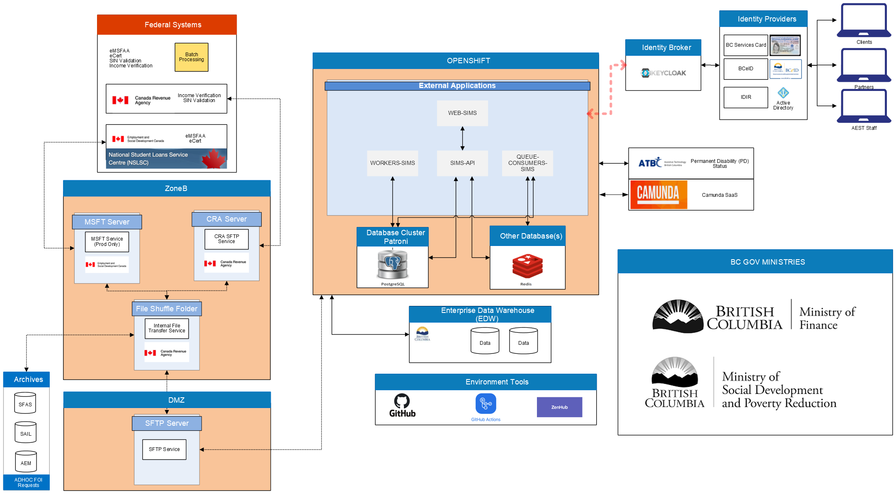

# SIMS 

Student Information Management System. This project will replace existing provincial student financial aid information systems and provide a modern application for students, post-secondary institution and ministry employees to manage post-secondary student loans. The project includes implementation of a business rules engine that can accommodate regular changes in alignment with policy. 

## Vision
To empower students to be engaged in their financial aid journey. 

## Objectives
- Provide an intuitive modernized application with more interactive components to Ministry, Institution and Student users 
- Improve business process and operations
- Automation of assessments and other workflows to reduce manual processing
- Self-serve for students with built-in guidance and more detailed assessment information 

## Problem Statement
StudentAidBC technology, processes and policy need to be aligned so that students have 

## Project Status

In Development

## Development Activity

High, new features released weekly

## Draft-Architecture

## Continue Reading

- [Technologies Overview](https://github.com/bcgov/SIMS/wiki/Technologies-Overview)
- [BCeID-Web Service Integration](./docs/bceid-webservice-integration.md)
- How To
  - [DevOps](https://github.com/bcgov/SIMS/wiki/DevOps-and-Running-the-Application#devops)
  - [Database Migration](./docs/howto/db-migration.md)
  - [Keycloak Configuration](https://github.com/bcgov/SIMS/wiki/Keycloak-Config)

## License

Code released under the [Apache License, Version 2.0](./LICENSE).
