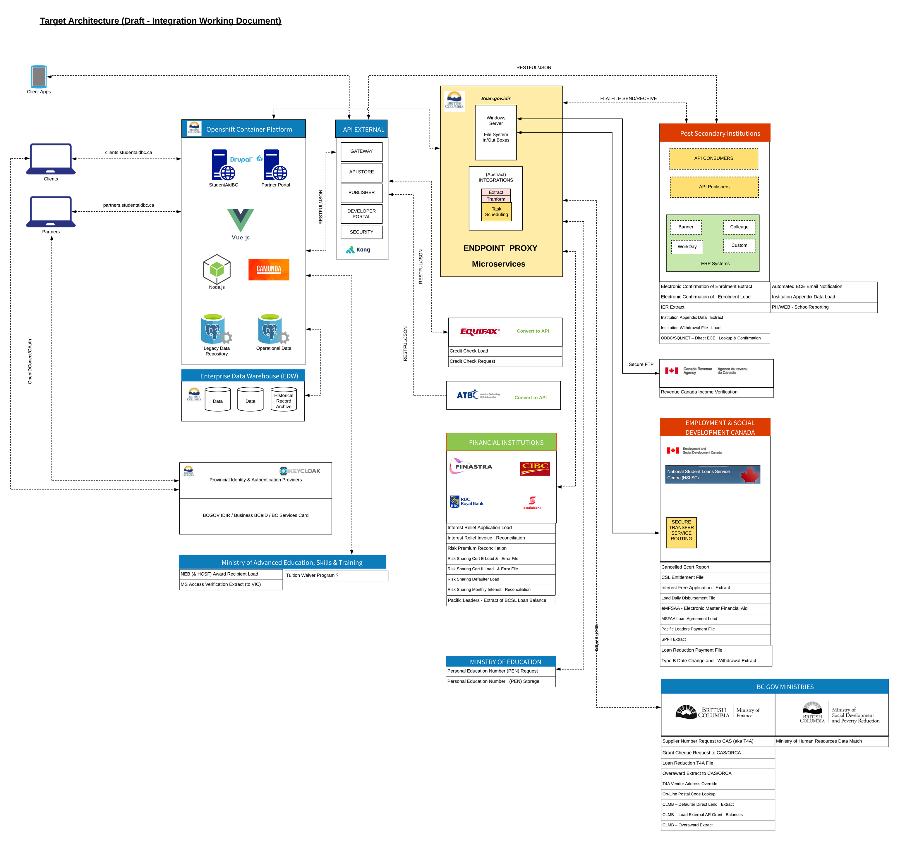

# SIMS

Student Information Management System. Post-Secondary Student Financial Aid System. 

## Project Status

In Development

## Development Activity

High, new features released weekly

## Objectives

Build and deliver the a modernized system to assist students receive the funding they need

## Architecture

## License

Code released under the [Apache License, Version 2.0](./LICENSE).
